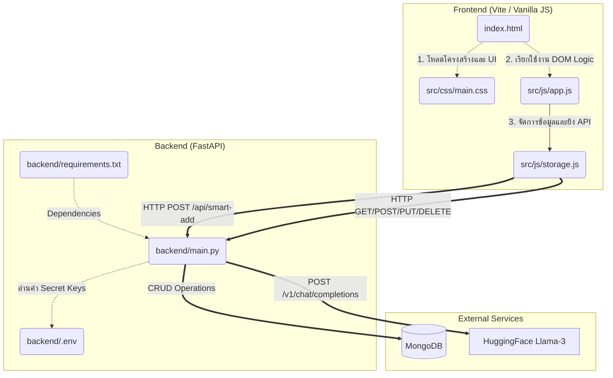
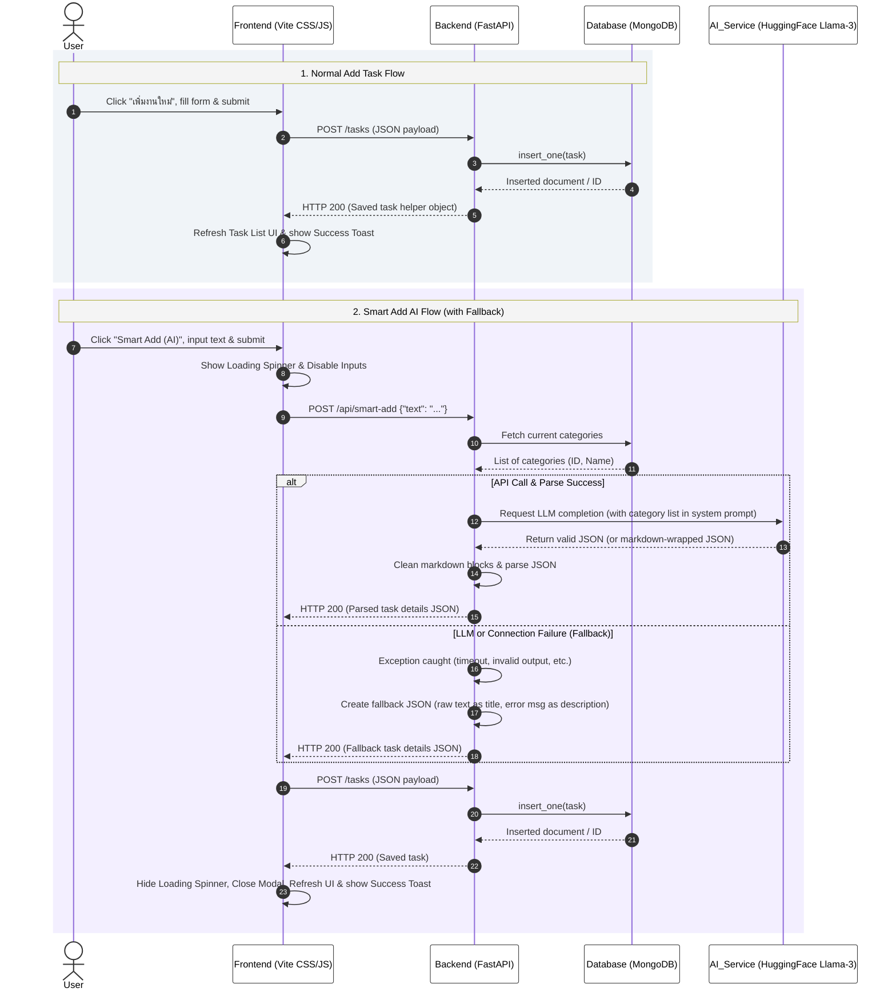

# 📝 TaskFlow - Modern Task Manager & To-Do App with AI Smart Add

**TaskFlow** คือแอปพลิเคชันจัดการรายการสิ่งที่ต้องทำ (To-Do / Task Manager) ยุคใหม่ ที่ผสานพลังของปัญญาประดิษฐ์ (AI) เข้ากับการออกแบบหน้าจอแบบ Modern Minimalist สวยงาม พรีเมียม ใช้งานง่าย และเน้นเพิ่มประสิทธิภาพในการทำงาน (Productivity) ของคุณได้อย่างลงตัว ด้วยหน้าตา UI สไตล์ Glassmorphism และระบบวิเคราะห์คำสั่งงานภาษาธรรมชาติด้วย LLM

---

## ✨ คุณสมบัติเด่น (Key Features)

- 🤖 **ระบบ Smart Add (AI Parsing):** วิเคราะห์ข้อความคำสั่งงานจากผู้ใช้แบบภาษาธรรมชาติ (เช่น *"ส่งรายงานภาษีให้ฝ่ายบัญชีด่วน พรุ่งนี้เช้าเก้าโมง"*) เพื่อดึงข้อมูลหัวข้อ (Title), รายละเอียด (Description), วันที่ครบกำหนด (Due Date), หมวดหมู่ที่ตรงกัน (Category), และระดับความสำคัญ (Priority) ออกมาเป็นโครงสร้างข้อมูลโดยอัตโนมัติ ด้วยโมเดล AI ผ่าน API
- 📥 **การจัดการภารกิจ (Advanced Task CRUD):** เพิ่ม, แก้ไข, ลบ และทำเครื่องหมายว่าเสร็จสิ้นงานได้อย่างราบรื่น
- 🏷️ **หมวดหมู่เชิงไดนามิก (Dynamic Categories):** จัดกลุ่มงานด้วยหมวดหมู่ที่ดึงมาจากฐานข้อมูล สามารถปรับแต่งไอคอนและสีประจำหมวดหมู่ได้ตามใจชอบ
- ⚡ **จัดลำดับความสำคัญ (Priority Levels):** แบ่งระดับความสำคัญของงาน (สูง, กลาง, ต่ำ) พร้อมสีสันนำสายตาแบบพรีเมียม
- 🔍 **ระบบค้นหาและตัวกรอง (Real-time Search & Filter):** ค้นหางานด้วยคีย์เวิร์ด หรือกรองงานตามตัวช่วยกรองด่วน (วันนี้, เร็วๆ นี้, เสร็จสิ้นแล้ว)
- 📊 **แดชบอร์ดสถิติแบบเรียลไทม์ (Live Stats Dashboard):** แสดงปริมาณงานคงเหลือและงานที่สำเร็จ พร้อมแอนิเมชันวงแหวนความสำเร็จ SVG (SVG Progress Ring)
- 🎨 **การออกแบบที่หรูหรา (Premium UI/UX):**
  - เอฟเฟกต์ Glassmorphism สะท้อนสไตล์กระจกฝ้าสวยงาม
  - แอนิเมชันแบบไมโคร (Micro-interactions) ที่ให้การตอบสนองที่ลื่นไหล
  - ระบบเปลี่ยนธีมมืดและสว่าง (Dark/Light Mode) ที่จดจำสถานะผ่านเซิร์ฟเวอร์
  - การจัดวางแบบตอบสนองทุกอุปกรณ์ (Fully Responsive Design) รองรับมือถือ แท็บเล็ต และคอมพิวเตอร์

---

## 🛠️ เทคโนโลยีที่ใช้ (Tech Stack)

- **Frontend (หน้าบ้าน):**
  - **Core:** HTML5 & Modern JavaScript (ES6+ Module)
  - **Styling:** Vanilla CSS3 (เน้นโครงสร้างสเปกสี CSS Variables และแอนิเมชันแบบ Custom)
  - **Development Tool:** [Vite](https://vitejs.dev/) (เครื่องมือรวมไฟล์และเซิร์ฟเวอร์พัฒนาที่รวดเร็ว)
  - **Testing:** [Vitest](https://vitest.dev/) (สำหรับรัน Unit Tests ของฟังก์ชันเชื่อมต่อ API)
- **Backend (หลังบ้าน):**
  - **FastAPI (Python):** เฟรมเวิร์กประสิทธิภาพสูง รวดเร็ว และรองรับ Asynchronous
  - **Pytest & HTTPX:** ระบบการทดสอบ Unit Tests ของ Backend พร้อมกลไก Mock ฐานข้อมูล
- **Database (ระบบฐานข้อมูล):**
  - **MongoDB:** ฐานข้อมูล NoSQL แบบ Document-based สำหรับเก็บข้อมูลงาน หมวดหมู่ และธีม
- **AI Service (บริการปัญญาประดิษฐ์):**
  - **Hugging Face Serverless API:** รันโมเดลภาษาขนาดใหญ่ (LLM) รุ่น `meta-llama/Meta-Llama-3-8B-Instruct` ผ่านไลบรารีอินเตอร์เฟส `openai` client

---

## 🗺️ สถาปัตยกรรมระบบ (System Architecture)

### 1. แผนผังโครงสร้างการเชื่อมโยงระบบ (System Architecture & Dependency Graph)



### 2. แผนผังลำดับเหตุการณ์การไหลของข้อมูล (System Sequence Diagram)



---

## 📂 โครงสร้างโฟลเดอร์ (Folder Structure)

```text
To-Do-App/
├── index.html              # ไฟล์หลักแสดงผลหน้าจอเว็บแอป
├── README.md               # รายละเอียดโปรเจกต์ (ไฟล์นี้)
├── sequence_diagram.md     # แผนภาพ Sequence Diagram ของระบบหลัก
├── package.json            # คอนฟิกูเรชัน Dependencies และคำสั่งรันของ Frontend
├── vite.config.js          # ไฟล์ตั้งค่าพัฒนาของเครื่องมือ Vite
├── src/                    # โฟลเดอร์หน้าบ้าน (Frontend)
│   ├── css/
│   │   └── main.css        # สไตล์การออกแบบ CSS และระบบธีมสี
│   └── js/
│       ├── app.js          # โค้ดควบคุมเหตุการณ์และแสดงผลหน้าจอ (DOM Logic)
│       ├── storage.js      # โมดูลจัดการส่งข้อมูลและเรียกใช้ Backend API
│       └── storage.test.js # โค้ดทดสอบ Unit Tests ของ Frontend ด้วย Vitest
└── backend/                # โฟลเดอร์หลังบ้าน (Backend)
    ├── main.py             # โค้ดเซิร์ฟเวอร์ FastAPI และ endpoints ทั้งหมด
    ├── test_main.py        # โค้ดทดสอบ Unit Tests ของ Backend ด้วย pytest (mock-based)
    ├── requirements.txt    # แพ็กเกจไพธอนที่ใช้ (FastAPI, pymongo, openai, etc.)
    └── .env                # ไฟล์กำหนดคีย์ความลับและสิ่งแวดล้อมระบบ (MONGO_URI, HF_TOKEN)
```

---

## 🚀 เริ่มต้นใช้งาน (Getting Started)

### 1. การตั้งค่าฝั่งหลังบ้าน (Backend Setup)

1. เข้าไปที่โฟลเดอร์หลังบ้าน:
   ```bash
   cd backend
   ```
2. สร้างและใช้งาน Virtual Environment:
   ```bash
   python -m venv venv
   # สำหรับ Windows (PowerShell):
   venv\Scripts\Activate.ps1
   # สำหรับ Mac/Linux:
   source venv/bin/activate
   ```
3. ติดตั้งแพ็กเกจที่ระบุในข้อกำหนด:
   ```bash
   pip install -r requirements.txt
   ```
4. คัดลอกและสร้างไฟล์สิ่งแวดล้อม `.env` (นำ HF_TOKEN ของคุณมาป้อน):
   ```bash
   # สร้างไฟล์ .env และป้อนข้อมูลดังนี้:
   MONGO_URI=mongodb://localhost:27017
   HF_TOKEN=your_hugging_face_api_token_here
   ```
5. รันเซิร์ฟเวอร์ Backend:
   ```bash
   uvicorn main:app --reload
   ```
   *หลังบ้านจะทำงานที่ตำแหน่ง: http://127.0.0.1:8000*

### 2. การตั้งค่าฝั่งหน้าบ้าน (Frontend Setup)

1. เปิด Terminal ใหม่ที่โฟลเดอร์รูทโปรเจกต์ (`To-Do-App/`)
2. ติดตั้งแพ็กเกจ Node.js:
   ```bash
   npm install
   ```
3. รันเซิร์ฟเวอร์จำลองการพัฒนา (Development Server):
   ```bash
   npm run dev
   ```
4. เข้าหน้าเว็บแอปพลิเคชันที่ระบุ:
   👉 **http://localhost:5173**

---

## 🧪 การตรวจสอบการทำงาน (Running Unit Tests)

โปรเจกต์นี้มีระบบทดสอบอัตโนมัติทั้งฝั่งหน้าบ้านและหลังบ้านอย่างครอบคลุม โดยไม่ต้องเชื่อมต่อไปยัง API หรือ Database จริง (Mock-based):

- **รันผลการทดสอบ Backend (Pytest):**
  ```bash
  cd backend
  venv\Scripts\python.exe -m pytest -v
  ```
- **รันผลการทดสอบ Frontend (Vitest):**
  ```bash
  npm run test
  ```

---

## 📄 ใบอนุญาต (License)

โปรเจกต์นี้อยู่ภายใต้ใบอนุญาต **MIT License** สามารถนำไปศึกษา ปรับแต่ง และพัฒนาต่อยอดได้ฟรี!
