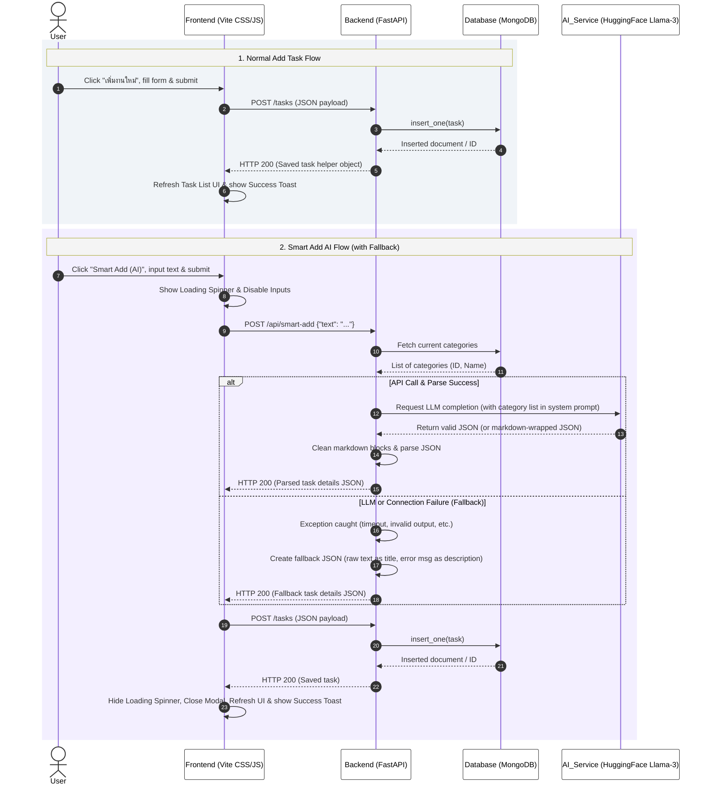

# TaskFlow System Sequence Diagram

This document contains the sequence diagram representing the core data flows of the TaskFlow application, including **Normal Add Task** and **Smart Add (AI)** with fallback error handling.

## Sequence Diagram

