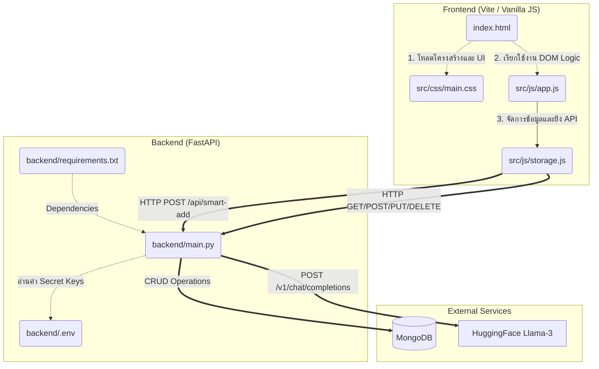

# TaskFlow System Architecture & Dependency Graph

This document details the system architecture and dependency graph of TaskFlow, showing the interaction between the frontend components, the backend server, database, and the Hugging Face AI service.

## Architecture Diagram

